## Course Information

The 2025 Wireless for IoT course culminated in a series of final projects led by individual groups. Each group was challenged to build a new wireless device, experiment with new software for wireless IoT devices, or investigate wireless IoT networks in the real world.

### Project List:

- [Resume Delivery System](#resume-delivery-system)
- [Rental Management System](#rental-management-system)
- [LoRa GPS Tracker](#lora-gps-tracker)
- [LoRa Fingerprinting Localization](#lora-localization)
- [IEEE 802.15.4 to BLE Bidirectional Bridge](#ieee-802154-to-ble-bidirectional-bridge)
- [NFC Sleep Checker](#sleep-checker)
- [BLE Controlled Car with Wi-Fi Video Streaming](#ble-controlled-car-with-wi-fi-video-streaming)
- [Anonymous Voting System](#anonymous-voting-system)
- [LoRa Agricultural Sensor](#lora-agricultural-sensor)
- [NFC Sign-in System](#nfc-sign-in-system)
- [Mail Delivery Notification System](#mail-delivery-notification-system)

## Resume Delivery System

**Members:** Leila Troxell, Connor Lewis, Katherine Capone, Mohit Pandey

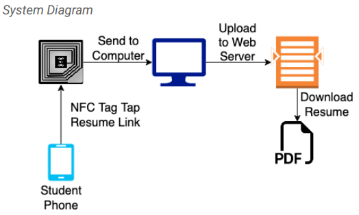

In a world where paper is out of date, resumes are difficult to quickly and easily distribute at career fairs and networking events. Most recruiters are left with piles of paper resumes, and those that choose to collect information electronically require students to complete a lengthy form when most students would prefer to spend their time networking with professionals. Our technology aims to solve this problem with an efficient, paperless solution. With our system, students can seamlessly tap their phone to the recruiter's NFC tag and deliver their resume. Students create a link that corresponds to their resume PDF and embed it as a URL record via the NFC Tools app. The recruiter possesses an nRF52840DK board with a Type 4 NFC tag that is programmed to be writable and is actively running. The student then taps their phone to the NFC tag. An NRF Connect application flashes the student's resume to the tag, and a python script running in the background parses the resume's URL record out of the NFC NDEF message and a script uploads the resume PDF to the recruiter's web service. This seamless process instantly places the student's resume on the recruiter's website for their more thorough review later, after the recruiting fair has completed.

## Rental Management System

**Members:** Raul Cancho, Sami Kang, Marvin Rivera Martinez, Salina Tran

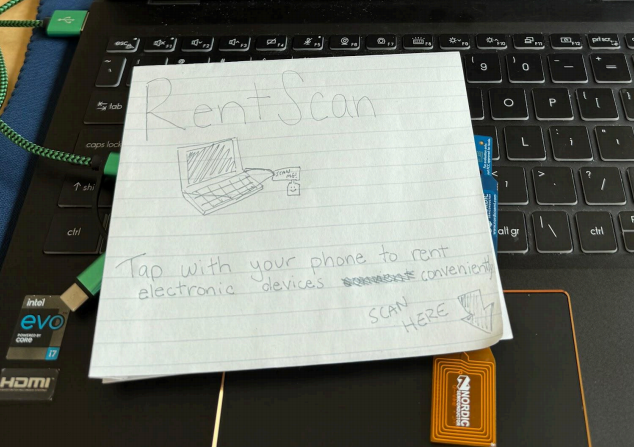

Our project, RentScan: Electronic Services, hopes to address the obstacles to accessing electronics. Our solution lets people visit any local department store to borrow essential devices like laptops needed for school or work. The rental process is extremely simple. Users just need their phone to scan a tag and reserve it for a certain usage time. It would be an improvement because it eliminates traditional paperwork and tedious checkout processes, which create obstacles to technology access. With the Near Field Detection tag, people can instantly reserve devices without waiting in lines to fill out forms, saving time. To start, it works by using an NFC (Near Field Communication) tag attached to each rentable device. When a user scans the tag with their phone, the tag sends a preconfigured NDEF (NFC Data Exchange Format) message containing information about the device. The NFC works in collaboration with Bluetooth Low Energy (BLE) to launch a rental request, which is then confirmed by a central BLE device that outputs a confirmation that the tag was scanned and rented out. The system handles rental logic and updates rental status in real time. This wireless integration simplifies the entire process and makes device access faster, more intuitive, and widely accessible. GitHub Repo Link: [https://github.com/ariveram128/NFC-Rental-System](https://github.com/ariveram128/NFC-Rental-System)

## LoRa GPS Tracker

**Members:** Rex Wang, Kevin Zhang, Kenny Tran, Alex Song

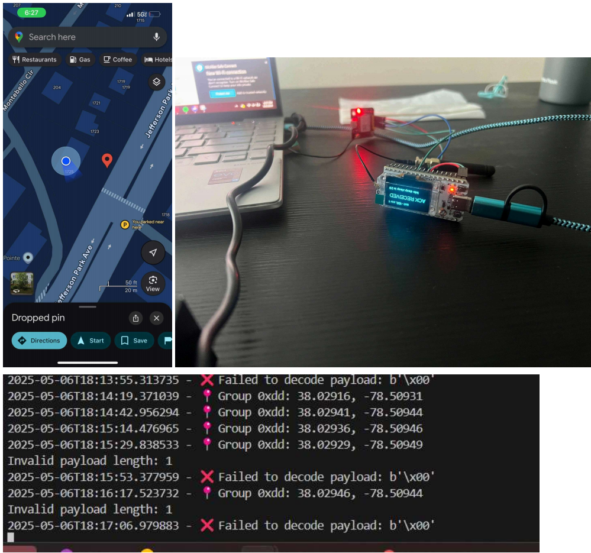

Losing an important and expensive piece of equipment through shipping and other ways has always been a problem. For our project we have decided to make a device that can track location through the current longitude and latitude of an object. Our wireless system is an improvement over normal LoRa because originally it doesn't have any location detection abilities so we added a gps onto it. We connected the system to the The Things Network and sent a payload to it. The payload is then decoded through python in a 9 byte packet (1 byte for Group ID, 4 bytes for longitude, and 4 bytes for latitude). The coordinates are then saved in a csv file. One problem that we ran into though was that it needed to be outside so it could detect a few satellites probably due to the inferences of the building.
{style="text-align: justify;"}

## LoRa Localization

**Members:** Andrew Morrison, Jacob Cochran, Austin Chappell

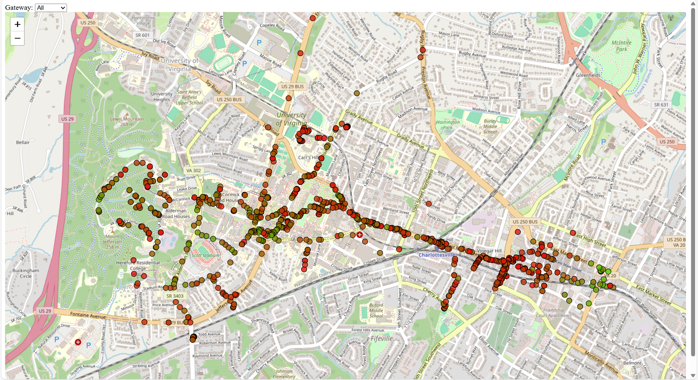

Some IoT devices move around and their location is important for readings that they involve. The simplest solution to knowing the location of these devices is to add a GPS to your IoT device, however there are many drawbacks to using GPS, such as increasing the cost per device by $5-10 and shortening battery life from years to months. Our solution to this problem uses LoRa gateways to cheaply determine the location of the device without using any device battery or much more cost. We accomplish this by using the RSSI values of at least 2 gateways and training a machine learning algorithm using these values and the location of the gateways to determine the location of the device.
{style="text-align: justify;"}

## IEEE 802.15.4 to BLE Bidirectional Bridge

**Members:** Connor Cutshall, Garrett Delaney, Husnain Choudhry, Patrick Gajewski

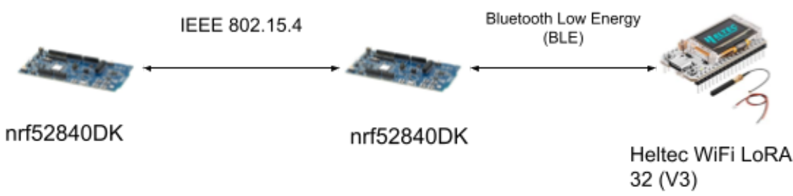

The goal of this project is to build a bridge device that can act as a translator between two separate IoT devices: one device that supports IEEE 802.15.4 but not BLE, and another that supports BLE but not IEEE 802.15.4. Many real world IoT and embedded devices will use just one or maybe two wireless protocols, but not a plethora of protocols like the nRF development boards. If you are working with devices or sensors that someone else built, you likely will not have any control over the wireless protocols available. If two devices use incompatible protocols, there is no way for them to directly communicate. That is where the IEEE 802.15.4 to BLE Bidirectional Bridge comes in handy as it acts as an intermediary that can receive, translate, and transmit packets back and forth between incompatible devices. The bridge works by first utilizing packet burst between the two NRF boards. Then, the 2nd nRF board acts as a central, and the Heltec collecting the temperature value acts as a peripheral. By pressing the button on the first nRF board, the temperature value gathered by the Heltec board is relayed through the 2nd nrF board back into the first nRF board.
{style="text-align: justify;"}

## Sleep Checker

**Members:** Daniel Sarria, Kyle Clemente

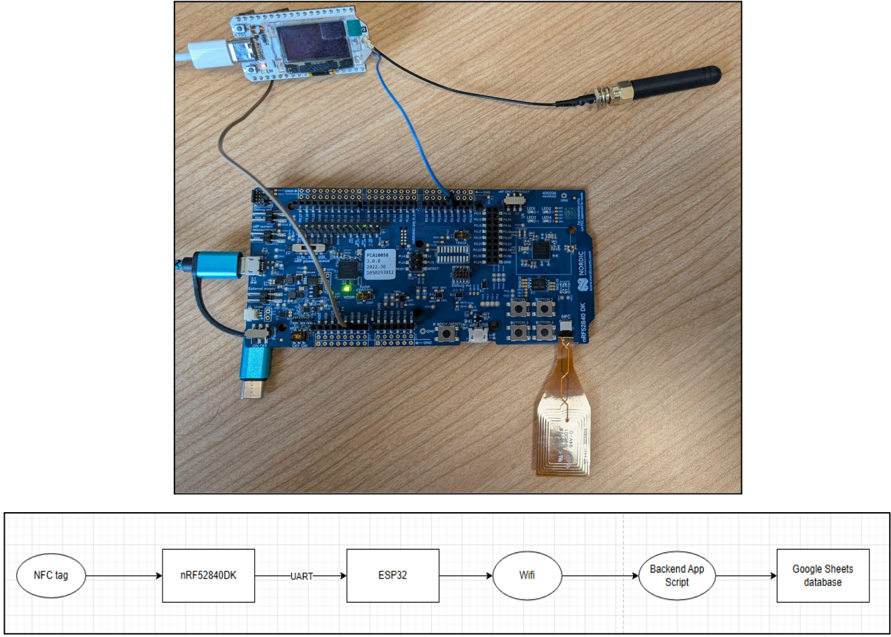

Our project addresses the challenge of promoting healthy sleep habits by providing an automated, real-time logging system for sleep and wake events, particularly benefiting individuals who may forget or struggle to manually track their sleep patterns. Traditional methods like journaling, app check-ins, or wearable devices often involve discomfort, manual input, or reliance on smartphone connectivity, whereas our solution leverages a wireless NFC-based system paired with an ESP32 microcontroller to seamlessly log sleep data. When a user taps their NFC tag before sleep or upon waking, the system toggles between "Sleep" and "Wake" states and sends the state and user ID via UART to an ESP32, which appends a timestamp and uploads the data to a central Google Sheets database via Wi-Fi. The system also generates sleep summaries, displaying total sleep time, averages, and recent sleep patterns with visual comparisons. This scalable and contactless approach ensures accurate sleep tracking while minimizing user intervention.
{style="text-align: justify;"}

## BLE Controlled Car with Wi-Fi Video Streaming

**Members:** Ethan Jacobson, Jackson Lamb, Maria Molchanova

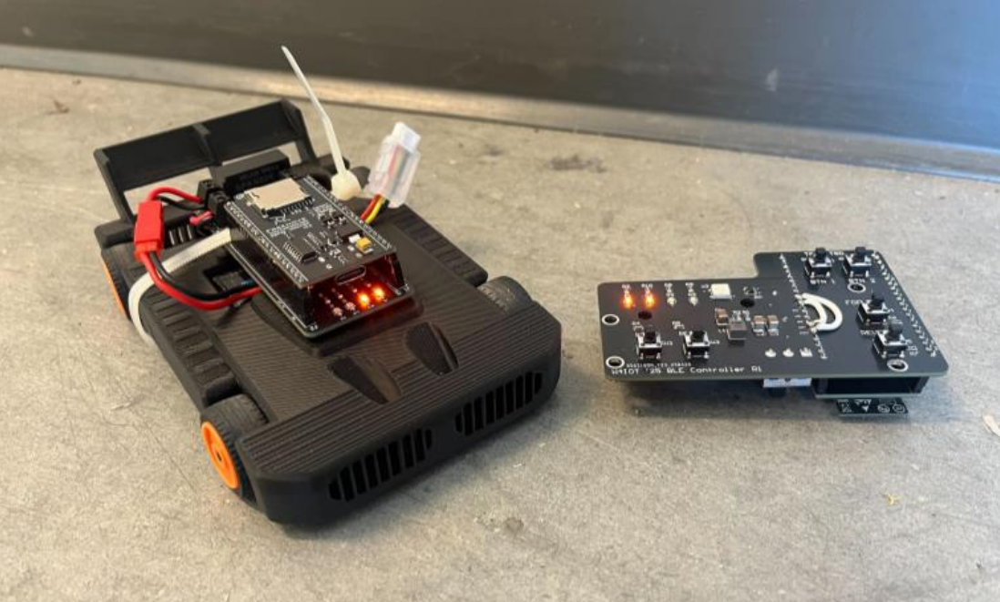

Our project explores the use of Bluetooth Low Energy (BLE) for wireless control of small robotic vehicles in short-range applications. While traditional radio-frequency (RF) control offers greater range, it typically requires dedicated hardware and is often limited to unidirectional communication. By integrating BLE, we were able to use off-the-shelf ESP32-based microcontroller boards on both the car and controller, eliminating the need for specialized radio transceivers and enabling bidirectional communication. Both the vehicle and the handheld controller use ESP32 modules to transmit and receive Bluetooth messages. Additionally, each device is equipped with Neopixel RGB LEDs, which provide status indicators and aesthetic underglow lighting. The vehicle streams live video from a browser-accessible web server, allowing real-time visual feedback. Propulsion is provided by two independent rear hub motors, each controlled by a Texas Instruments DRV8962DDWR dual H-bridge motor driver. Pulse-width modulation (PWM) is used to achieve variable speed control in both forward and reverse directions. The car employs skid steering, enabling full directional control without the need for a mechanical steering rack.
{style="text-align: justify;"}

## Anonymous Voting System

**Members:** Saugat Lamsal, Thomas Johnson, Jeanu Joo

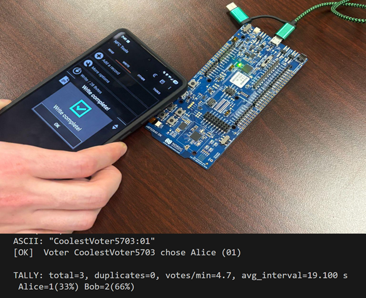

Paper-based ballots are slow, error-prone, and require manual transport and counting, leading to delays of days or even weeks before results can be counted. Our NFC+BLE system enables anonymous, in-person voting by using NFC tags. Deployment requires no existing infrastructure, just off-the-shelf NFC tags and a battery-powered BLE central, making pop-up polling sites or remote voting easy to set up and use. Voters simply tap their NFC-enabled phone to write a short “ID:choice” text record on the tag, which immediately notifies and sends to the central node via BLE with no permanent data being stored on the tag. Our central then parses, filters, tallies, and logs each vote to the console in real time. This requires no experience/training, simple and easy for the voter, and delivers near-instant, verifiable results while preserving anonymity. 
{style="text-align: justify;"}

## LoRa Agricultural Sensor

**Members:** Bao Doung, John Rankin, Shaunak Sinha

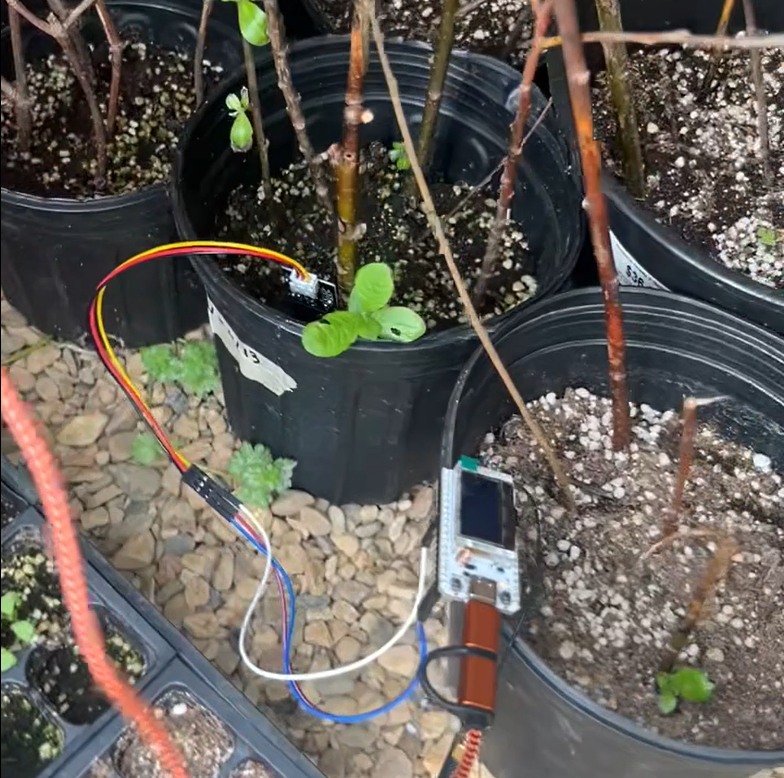

Our team chooses to undertake the challenge of sending important agricultural data over long distances. For example, farms are the priority use case of agricultural data. From important information about soil, to data about crops, there is a vast amount of data that runs through farms that farmers and industry experts alike could utilize to improve farming and yield better outcomes. However many of these farms are massive, and building an interconnected system of sensors over long distances can present extremely difficult challenges, especially in rural areas. Hence the goal of our project was to tackle the issue of sending important agricultural data, specifically soil and temperature data over long distances via LoRa which is a form of long-range, low-power communication. By integrating a long range, lower-power communication with sensor integrated networks, it presents the perfect solution for farms in rural areas. Soil data is not intensive and hence lacks the need for advanced communication. Additionally, LoRa allows the data to be sent throughout the entirety of these massive farms while utilizing minimal power, allowing farmers to not worry about setting up complicated networks. Through a system connecting both these sensors and advanced wireless protocols, farmers can see trends in irrigation, temperature and other applications that are relevant based on soil data, and use that to better improve farming and crop outcome. 
{style="text-align: justify;"}

## NFC Sign-in System

**Members:** Michael Sekyi, Kofi Darfour

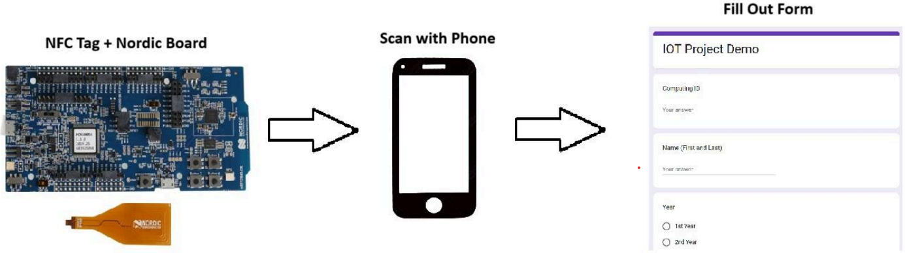

The Center for Diversity in Engineering (CDE) is a student space dedicated to advocating for underrepresented groups in STEM. Currently, it uses an iPad-based survey system for sign-ins. While effective in quieter moments, this setup becomes inefficient during events or meetings when multiple attendees arrive simultaneously. To address this bottleneck, our team developed an NFC-based wireless sign-in system that dramatically reduces friction. Instead of queueing to manually fill out a form, students can now simply tap their NFC-enabled smartphones to an NFC tag at the entrance. This instantly opens a web-based sign-in form, enabling seamless and rapid user check-in. The solution is more accessible, minimizes congestion, and is particularly effective in high-traffic scenarios like meetings or CDE-hosted gatherings. Our system uses a passive NFC tag, programmed with a URI (Uniform Resource Identifier) record that links directly to an online form (e.g., a Google Form). These tags require no power source and activate when tapped by an NFC-compatible smartphone, which reads the stored URL and opens the form in the browser automatically. On the backend, all responses are logged in a connected Google Sheet for easy access and analysis. Additionally, the system is very scalable, meaning multiple tags can be placed around the space.
{style="text-align: justify;"}

## Mail Delivery Notification System

**Members:** Moses Zhang, Vikranth Nara

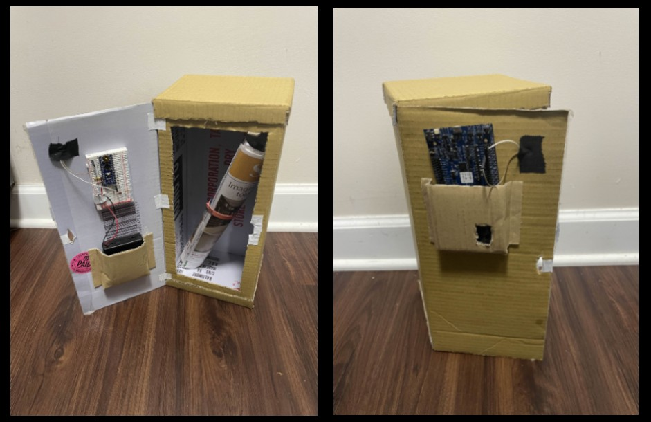

The purpose of this project was to create a wireless solution to infrequent mailbox usage. One of our group members receives mail quite infrequently, thus making it unnecessary to check for mail every single day. This circuit uses a photoresistor to detect when the mailbox is open, which then causes an nrf52840 board to send a bluetooth notification to a mobile device. The main circuit board is placed on the inside of the door which opens and closes. This causes there to be a voltage reading from a voltage divider using the photoresistor to change dynamically with how much light the board receives (i.e. when the door opens and closes). The circuit itself uses an Arduino nano to convert the analog input from the voltage divider into a digital output, which is then read by the nrf52840. If the nrf52840 reads a voltage of over 2 volts, this is interpreted as the mailbox being opened. Upon sending a bluetooth notification, the board then sleeps for a designated amount of time, as one would not expect mail terribly frequently. This allows the person who is receiving mail to be notified in their home right when they get mail, without having to physically check their mailbox every so often.
{style="text-align: justify;"}