## Course Information

The 2026 Wireless for IoT course culminated in a series of final projects led by individual groups. Each group was challenged to build a new wireless device, experiment with new software for wireless IoT devices, or investigate wireless IoT networks in the real world.

We appreciate Priyanka Gupta and Paul Otto from Teledyne Lecroy at Charlottesvile for their support on the course project. This year, two student teams worked on using LLM to analyze wireless traffice data captured by Teledyne's Frontline X700 Wireless Protocol Analyzer.

### Project List:

- [Event Information Distribution System](#event-information-distribution-system)
- [People Counting System](#people-counting-system)
- [Teleoperated Robot](#teleoperated-robot)
- [LoRa Tripwire](#lora-tripwire)
- [Cabin Temperature Monitor](#cabin-temperature-monitor)
- [NFC Lost Item Tracker](#nfc-lost-item-tracker)
- [BLE and Wifi Congestion using LLM](#ble-and-wifi-congestion-using-llm) **(Sponsored by Teledyne Lecroy)**
- [Focus-Sync System](#focus-sync-system)
- [Environmental Monitoring System](#environmental-monitoring-system)
- [Gym Equipment Management System](#gym-equipment-management-system)
- [LLM-Assisted Wireless Traffic Analysis](#llm-assisted-wireless-traffic-analysis) **(Sponsored by Teledyne Lecroy)**
- [Trivia Distribution System](#trivia-distribution-system)

## Event Information Distribution System

**Members:** Mujtaba Jarral, Momen Abdelmoaty, Jason Cox

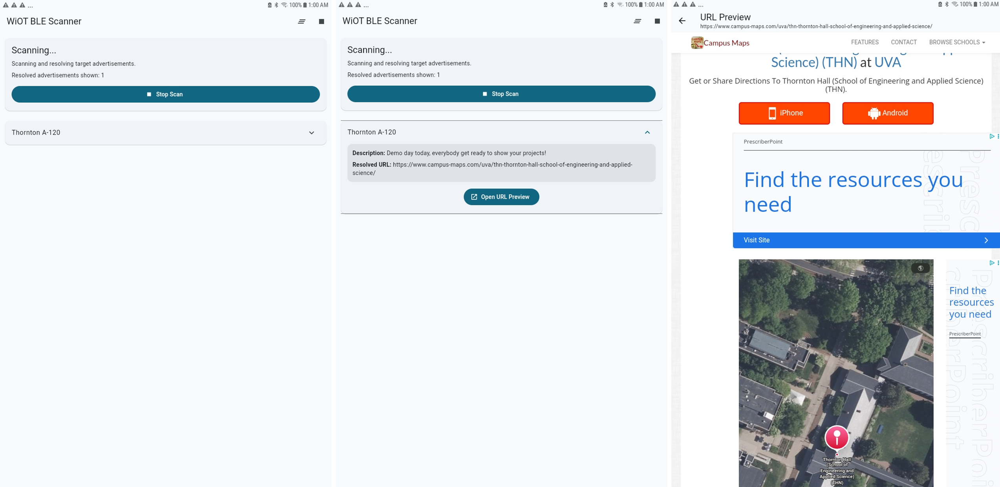

The project addresses the challenge of distributing information to passersby in an area. The project utilizes a BLE device to distribute information such as an event name, description, and a URL. This is an improvement over flyers and QR codes because it can reach more people over an area without physical papers or material being necessary, reducing the amount of materials used, making information and URL distribution more convenient and obvious, eliminating the need to find appropriate space for flyers or QR codes. The nRF board acts as a peripheral that sends out BLE advertisements which utilize a custom format that have a unique payload in the first 6 bytes, and have a PDU length of 12 to 14 bytes in total. A device running our own Flutter app detects these BLE advertisements, filtering by PDU length and our unique payload. The advertisement carries a 6 to 8 character long unique ASCII URL shortener code. The app decodes the URL shortener code into a unique link that contains “fake” query parameters that contain information such as the name and description of the URL. These are displayed in the app. The “fake” query parameters are removed and the unique link is reconstructed by the app, and the website may be previewed from the app.

## Rental Management System

**Members:** Bogdan Antonenko, John Devost, Vincent Zhang

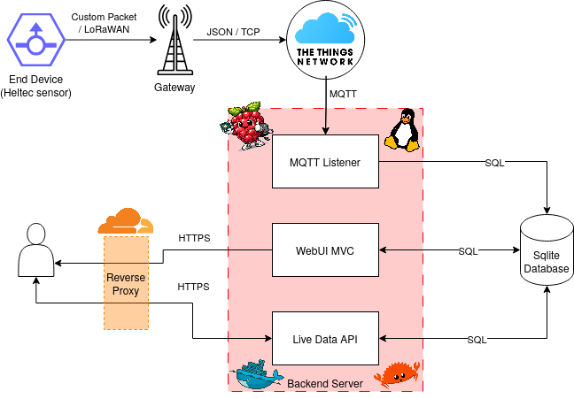

Counting people in busy spaces is useful for managing scheduling and safety, but solutions like door counters or CO2 sensors require fixed sensors and struggle with open environments, like outdoor spaces. Our system passively scans for BLE advertisements emitted by personal devices. We demonstrate this using three Heltec v3 boards deployed across 13 buildings on Engineering Way over three days. Because iPhones continuously broadcast BLE advertisements even when idle, the number of detected Apple phones serve as a reliable proxy for occupancy, as it can be adjusted to yield an estimate of people in the area. Device type is inferred from manufacturer IDs, BLE appearance values, and service UUIDs, and these characteristics are used to filter out non-personal devices. Each board transmits 22-byte payloads over LoRaWAN to The Things Network, where data is stored in a backend database using MQTT and displayed on a live web dashboard with capacity thresholds and trends. The system is most practical for relative trend analysis and outdoor occupancy estimation where alternatives are difficult to deploy and struggle in those conditions.

## Teleoperated Robot

**Members:** Farjan Ahmed, Carlos Giron, Ivan Post

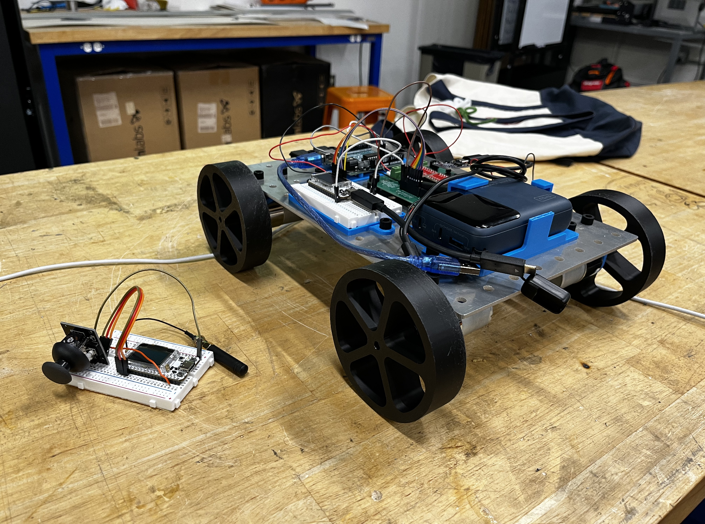

Two of our team members are in the Mechatronics and Robotics Society at UVA, which aims to compete in the University Rover Challenge (URC) next year. In URC, robots need to be tele-operated up to 1 km away. In practice, you can use a drone-mounted or even deployed repeater to reduce the node-to-node distance to 0.5 km, but this is not feasible with most unlicensed band wireless protocols such as Bluetooth. We attempted to create a prototype mobile robot which could be controlled in real time from 0.5 km away while only using unlicensed communication bands. While we could not get reliable control over 0.5 km, we were able to get up to 0.32 km using the LoRa physical layer standard (spreading factor of 10, coding rate of 4/5, and transmission power of 22 dBm) implemented on Heltec ESP32 v3 LORA boards. Our system implements a custom link layer protocol over LoRa taking inspiration from Bluetooth Low Energy connections, where the controller and robot alternate between sending and receiving packets, to achieve real-time control. The robot can also reply with feedback from sensors so that the operator does not need to see the robot (although this was not used in our implementation due to time constraints).

## LoRa Tripwire

**Members:** Zachariah Khaled Risheq, Snail Hernandez, Jayden Pierre 

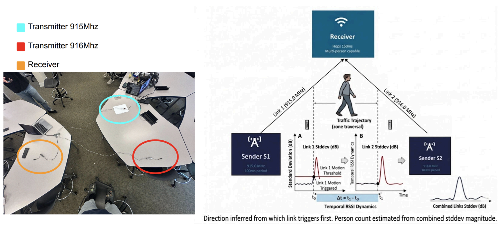

We created a tripwire using radio signals from LoRA that detects how many people are walking through and which direction they are walking. Our approach offers advantages over existing solutions: unlike cameras, it requires no line-of-sight, operates in any lighting condition, and captures no identifiable imagery, eliminating privacy concerns; unlike IR break-beams, it does not require single-file passage and can detect multiple people walking side-by-side through the same aperture. The system uses three LoRa devices (with two transmitting signals and one receiving) arranged in a triangle; by fitting a Gaussian baseline on a rolling standard deviation over a sliding window of the 8 most recent RSSI samples per link of each link and detecting deviations that exceed 1.5 dB (calibrated empirically from our original corridor setup) for two consecutive measurements in real time, it determines both the presence and direction of travel from the temporal ordering of disturbances across links. Person count is estimated by summing the peak standard deviations across both links during an event. When a person passes through the sensor field, they attenuate or reflect the received signal strength (RSSI) at nearby nodes in a measurable pattern. By analyzing which node detects a disturbance first and second, the system can reliably infer the direction of travel. Future work will replace the fixed detection threshold with an online Gaussian Process regressor that self-calibrates to each deployment environment, enabling probabilistic person counting via a softmax head over the GP posterior and scaling to additional nodes for finer spatial resolution and predictive crowd flow modeling across venue entry points.

## Cabin Temperature Monitor

**Members:** Aaron Yuan, Holly Kiker, Jungtaek Hong

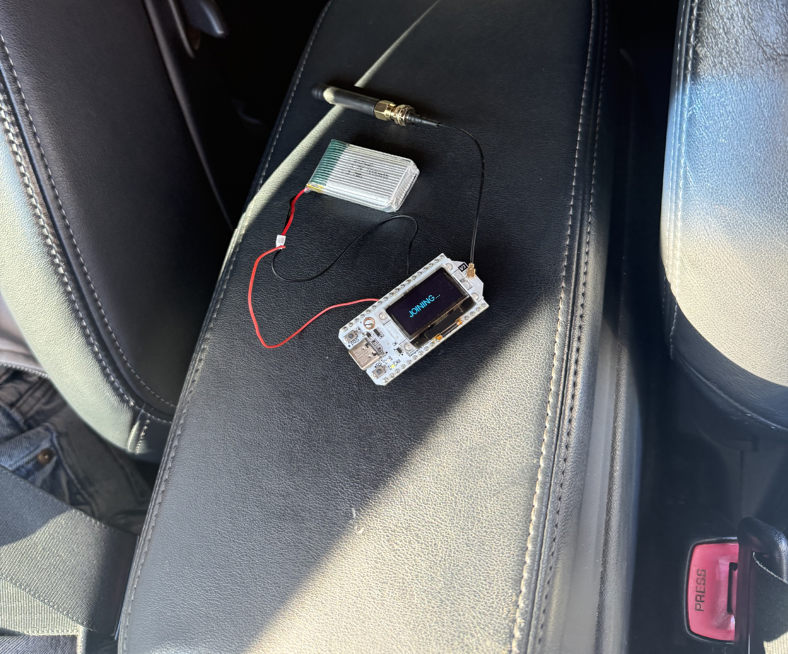

Extreme temperatures can make it difficult for anyone to want to go anywhere, especially knowing that they'll have to bear the transition period of their car's cabin temperature becoming more comfortable. With the increasingly popular option for drivers to remotely start their cars, we looked for a way to eliminate this uncomfortable wait. Our group used the Heltec LoRa 32 board to constantly monitor car cabin temperature with very low power usage, even while the owner is away. The device sends this data to The Things Network. Users can subscribe to a Telegram bot for their vehicle and set their desired in-cabin temperature. Then, they can start their car and finish getting ready to leave their home. Telegram communicates with The Things Network to know when the device has sensed the desired in-cabin temperature, and notifies the user accordingly.

## NFC Lost Item Tracker

**Members:** Yechan Kim, Nate Owen, Jason Kaniecki

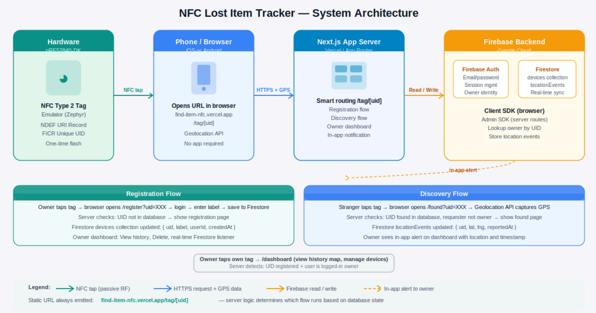

We built a passive NFC-based lost item tracker using the Nordic nRF52840-DK development board, a Next.js web application deployed on Vercel, and Firebase as the backend. The nRF52840 emulates an NFC Type 2 Tag using Zephyr RTOS, encoding a single NDEF URI record that directs any tapping phone,iOS or Android, to a URL hosted on our server. No app is required; the phone's built-in NFC system handles everything. The board is flashed once and never needs to be reprogrammed, since all logic lives in the web server. Our system improves on existing solutions in three key ways:
- Zero power consumption on the tag — NFC is a passive technology; the board draws no power until tapped.
- Platform-agnostic — any smartphone with NFC can trigger the flow without installing an app.
- Open and extensible — built on standard web technologies (Next.js, Firebase) with no proprietary lock-in.

## BLE and Wifi Congestion using LLM

**Members:** Noor Nile, John Xereas, Brian Xu

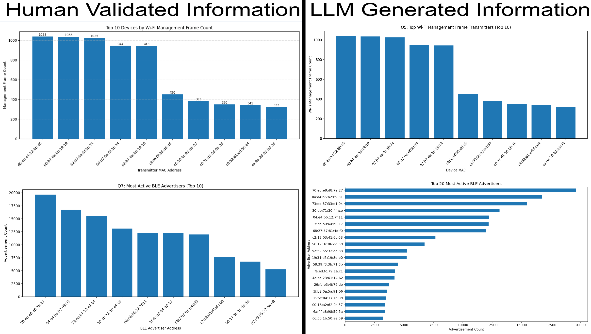

Our project was made to address the challenge of efficiently analyzing large-scale wireless traffic captures from Wi-Fi and BLE environments specifically. Typical models of doing so approach the problem directly by sending the packet captures or large portions of parsed packet data to an LLM which is expensive, inefficient, and unable to include all captured packets due to cost. To improve this we made our system convert the .pcapng captures into normalized Parquet datasets for Wi-Fi management frames and BLE advertising events containing structured wireless metadata such as MAC addresses, RSSI, channels, timestamps, SSIDs, and advertising information. Because LLMs cannot directly analyze Parque files, we use Pandas DataFrames loaded from the normalized Parquet datasets for local processing and analysis. Rather than sending large amounts of raw packet data to the LLM, we provide the model with the schema, headers, and structure of the normalized datasets and use the LLM to dynamically generate Python analysis code tailored to a user’s question. The generated Python code is then executed locally against the full DataFrames, allowing analysis over the entire wireless capture while keeping OpenAI API token usage extremely low. The resulting analysis can then be output in multiple formats, including textual summaries, ranked tables, incident reports, and generated graphs saved directly through the executed Python code. To ensure reliability and reduce hallucinations from the model, we also built a validation framework that independently computes answers to a set of “golden questions” directly from the normalized wireless datasets and compares them against the LLM-assisted analysis output.

## Focus-Sync System

**Members:** Amogh Ghadge, Sri Kapa, Patrick Junseo Lee

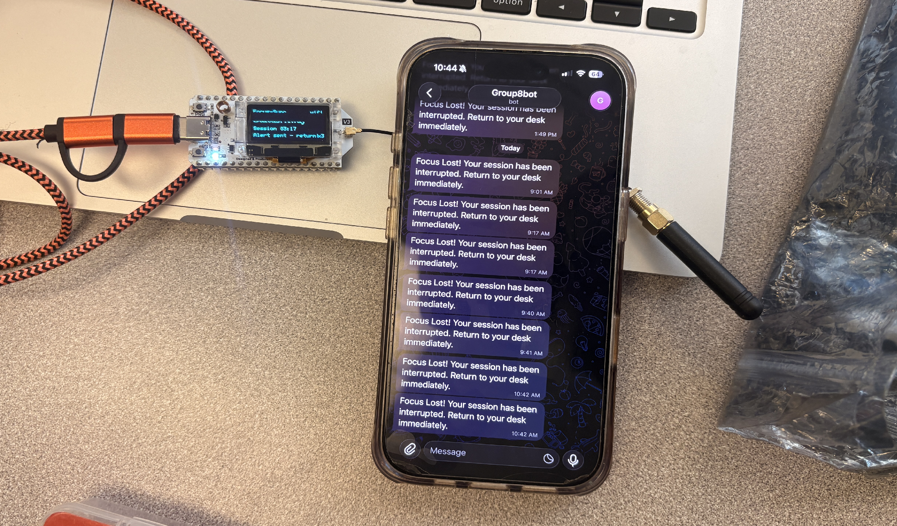

The challenge our project aims to address is the struggle to focus for long periods of time. While there are a multitude of apps and software that attempt to help the user stay focused and distraction free, none of them have a physical component. By adding a physical button, flashing lights, as well as an alert sent to the user’s phone, the multi-pronged approach optimizes for higher user retention. The basic overview is as follows: the Heltech board runs a timer which represents a "focus session". If at the end of the focus session, the user is required to check in by pressing the onboard button. If the button is not pressed during the grace period (where the onboard lights will be flashing), the system will send an alert message to a Telegram bot on the user’s phone. The system keeps track of the number of focus sessions completed and displays the timer on the boards screen.

## Environmental Monitoring System

**Members:** Ellie Kim, Diana Lin, Jessica Su

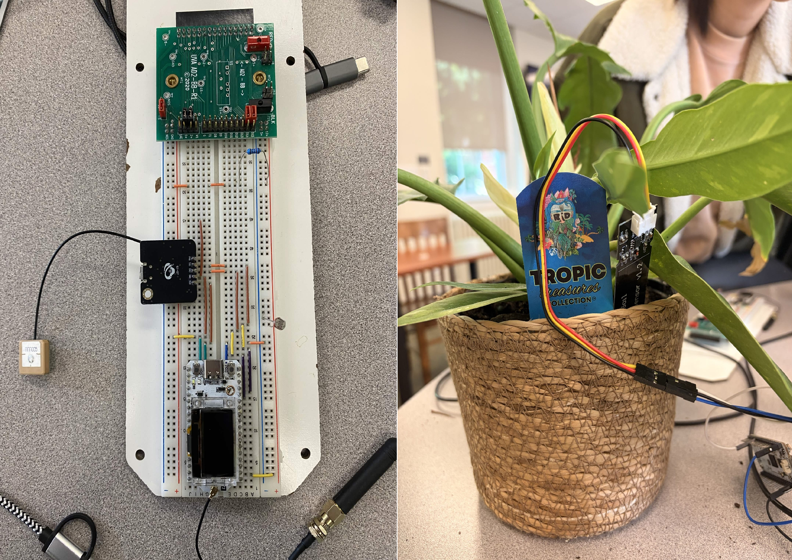

Terra is an environmental monitoring system designed for use in remote and unknown environments. This system involves one central device to store and manage all collected data and provide users access to this data over an HTTP API server over Wi-Fi. Three peripheral “recon” nodes gather environmental data, including light, soil moisture, and GPS location, and transmit this data to the central unit using LoRa. Terra has several practical applications, particularly in agriculture and environmental monitoring. Farmers could use the system to remotely monitor soil conditions, track environmental changes, and improve crop management decisions. The system could also support disaster detection and early warning efforts by identifying unusual weather or environmental changes in remote areas where traditional monitoring infrastructure may be limited. This improves on existing methods, where all sensing devices would need to be connected to the same WiFi or mesh network, thereby decreasing the overhead to set up an environmental monitoring system in a new location and allowing devices to be  connected at a higher distance from each other.

## Gym Equipment Management System

**Members:** Luke Mauzy, Miles Woodcock, Will Conrad

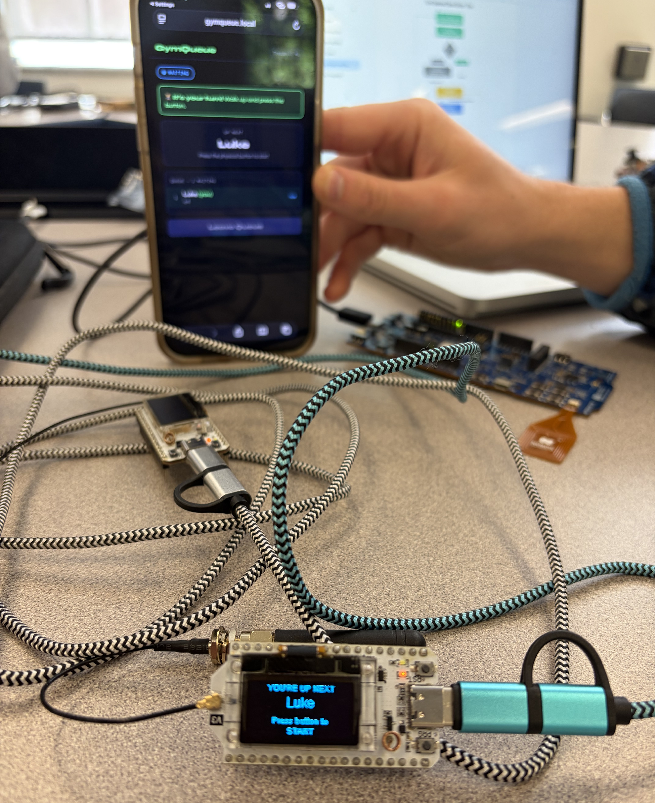

Gym equipment at busy recreation centers often turns into a waiting game: people hover near machines unsure when they’ll be free, there’s no clear visibility into wait times, and no practical way to plan or reserve equipment in advance. Our system addresses this by adding a lightweight and low-cost queue management layer directly onto each machine. Every piece of equipment is paired with a Heltec V3 board (acting as the local controller) and an nRF loop antenna that enables simple NFC-based check-in. A second Heltec unit acts as the server, running a minimal web interface over a local WiFi network. Looking ahead, the system is designed to scale into a full facility-wide coordination platform. A centralized dashboard could provide a real-time overview of all machines in the gym, showing queue lengths, estimated availability, and current utilization across the entire space. This would allow users to make informed decisions before even walking to a machine and help facilities balance load during peak hours. Another planned extension is integration with personal workout tracking systems. Each session could automatically sync to a user’s profile, building a structured workout history that includes completed sets, timing, and frequency of equipment usage. Over time, this could support personalized workout planning, progress tracking, and recommendations based on past behavior.

## LLM-Assisted Wireless Traffic Analysis

**Members:** Chau Nguyen, Yushen Liu, Zebenai Melaku, Zhibin Nan

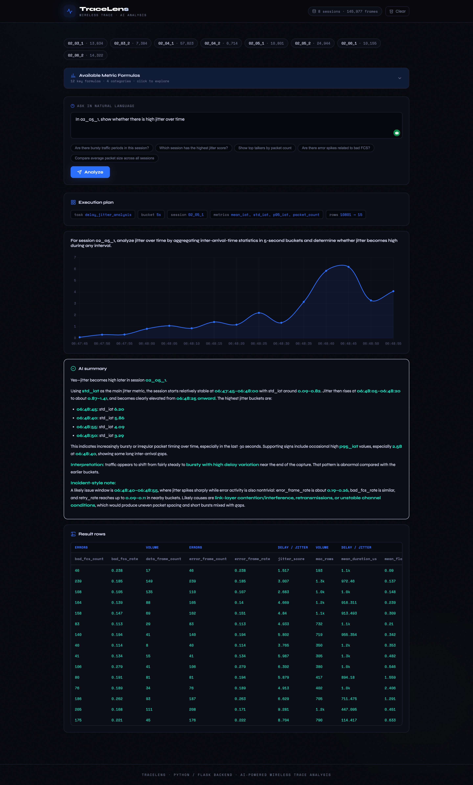

TraceLens is an LLM-assisted wireless traffic analysis system designed to make WiFi trace inspection easier, faster, and more accessible. Traditional wireless trace analysis often requires users to manually inspect large CSV exports, write custom pandas scripts, and understand low-level networking metrics such as packet rate, inter-arrival time, retry rate, and Bad FCS rate. This process is time-consuming and difficult for users who want quick answers to high-level questions such as “Which session has the most bursty traffic?” or “Which capture has the highest retry rate?” Our project addresses this problem by combining a deterministic Python-based traffic analysis pipeline with a large language model interface. The system allows users to ask natural-language questions about wireless traffic sessions. The LLM translates the question into a structured analysis plan, the backend executes the plan using local pandas/numpy computations, and the LLM then summarizes the result in readable language. This design keeps the numerical analysis grounded in the actual trace data while using the LLM to improve usability and interpretation. The project includes both a command-line pipeline and a local web interface. The command-line version supports direct LLM-based analysis over a dataset folder, while the TraceLens web application provides a chat-style interface so users no longer need to type questions into the terminal. The web app is implemented with a Flask/Python backend and a lightweight frontend for interaction and visualization. The source code for the project is available on GitHub at: [https://github.com/Hudl1e/traffic_llm_analysis](https://github.com/Hudl1e/traffic_llm_analysis).

## Trivia Distribution System

**Members:** Colby Wise, Marc Rosenthal

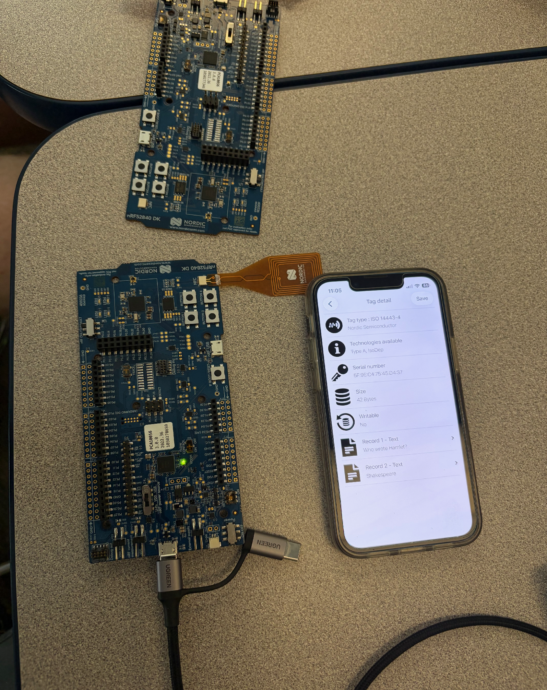

Our project is a tool to be used for trivia. It can be part of a system for many people to be able to access random trivia questions for whatever purpose the trivia is being run. This could be a situation like walking through a museum, classroom education, or bar trivia. Our project is a system in which the user reads a trivia question from an NFC tag, which gets updated with a new trivia question after this action occurs; people can keep scanning it and get new questions each time. This is an improvement over current systems because it requires minimal connectivity effort on the part of the user, yet can keep getting updated information. The system works by connecting to another device through BLE, then receiving new trivia questions from that other device each time it is run. That new trivia question is then written to the NFC tag to be read.